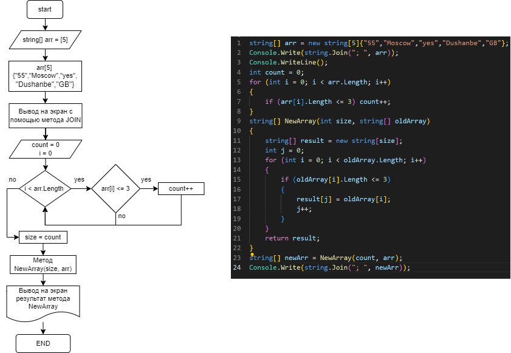

**Задача**: написать программу, которая из имеющегося массива строк формирует массив из строк, длина которых меньше либо равна 3 символа.  Первоначальный массив можно ввести с клавиатуры, либо задать на старте выполнения алгоритма. При решении не рекомендуется пользоваться коллекциями, лучше обойтись исключительно массивами.

Для начало создадим блок схему решения задачи:

Суть в том, что пройдёмся по заданному массиву и найдём количество элементов длина которых равна либо меньше 3 символа.
Напишем метод, кторый создаёт новый массив размером количеству этих элементов. Из заданного массива выделит подходящие условию элементы и запищет их в новый массив.